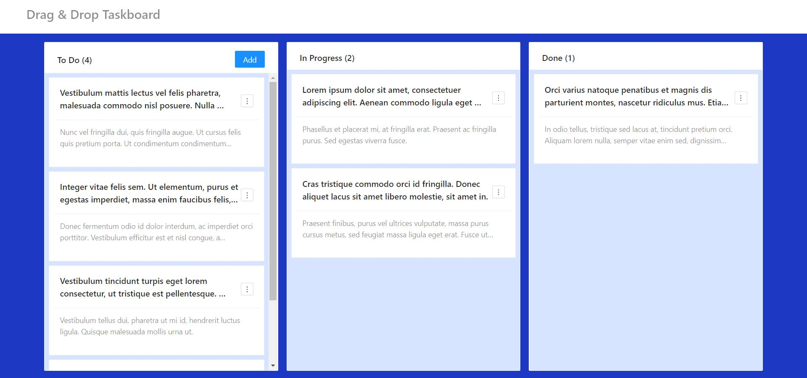

# Drag & Drop Taskboard

A taskboard application with drag and drop feature.  
Live demo is **[here](https://onderonur.github.io/drag-and-drop-taskboard/)**.

## Tech Stack

- Language: [TypeScript](https://www.typescriptlang.org/)
- UI-Components: [Ant Design](https://ant.design/)
- Icons: [Ant Design Icons](https://ant.design/components/icon/)
- Drag & Drop: [react-beautiful-dnd](https://github.com/atlassian/react-beautiful-dnd)
- Styling: [styled-components](https://styled-components.com/)
- Linting: [ESLint](https://eslint.org/)
- Code Formatting: [Prettier](https://prettier.io/)
- Deployment: [GitHub Actions](https://github.com/features/actions)
- Hosting: [GitHub Pages](https://pages.github.com/)

## Features

🖋 Create, edit & delete tasks  
☝ Change task order and status by drag & drop  
💾 Tasks are persisted to localStorage  
🔃 Sync between tabs  
🚀 Automated deployments with GitHub Actions  

## Development
### `npm start`

Runs the app in the development mode.\
Open [http://localhost:3000](http://localhost:3000) to view it in the browser.

The page will reload if you make edits.\
You will also see any lint errors in the console.

### `npm run build`

Builds the app for production to the `build` folder.\
It correctly bundles React in production mode and optimizes the build for the best performance.

The build is minified and the filenames include the hashes.\
Your app is ready to be deployed!

See the section about [deployment](https://facebook.github.io/create-react-app/docs/deployment) for more information.
